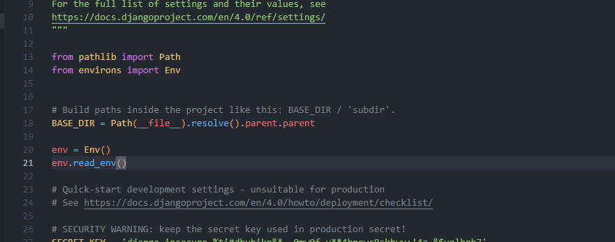
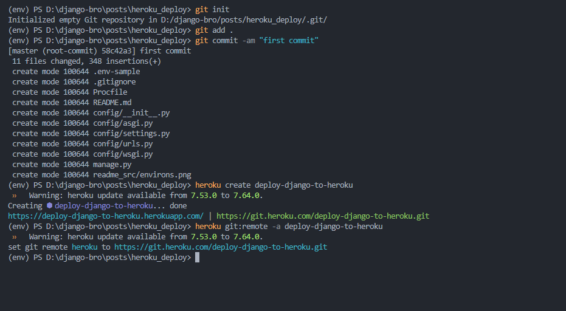
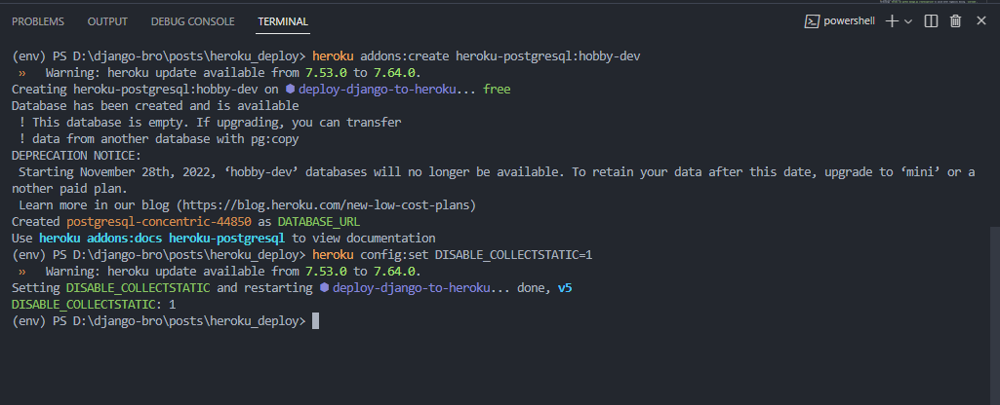

# Django applicationni herokuga deploy qilish 

## Bo'limlar 
1. [Django applicationni herokuga deploy qilish](#django-applicationni-herokuga-deploy-qilish)
2. [Muhitni sozlash](#muhitni-sozlash)
3. [settings.py faylida o'zgartirishlar](#settingspy-faylida-ozgartirishlar)
4. [Gitignore faylida o'zgartirishlar](#gitignore)
5. [Procfile fayli](#procfile-fayli)
6. [requirements.txt fayli](#requirementstxt-fayli)
7. [Heroku deploy qismi](#heroku-deploy-qismi)


## Django applicationni herokuga deploy qilish
1. Muhitni sozlash
2. settings.py faylida o'zgartirishlar
3. Procfile fayli
4. requirements.txt fayli
5. Heroku deploy qismi

## Muhitni sozlash
1. Heroku uchun account ochish
saytga kirib account ochish uchun [bu yerga](https://signup.heroku.com/) bosing.
2. Heroku CLI ni o'rnatish
[Heroku CLI](https://devcenter.heroku.com/articles/heroku-cli) saytida ko'rsatilgan qo'llanma bo'yicha o'rnatishni bajarish kerak. 
3. Heroku CLI ni ishga tushirish
terminalga `heroku login` yozib enter tugmasini bosing.
4. Heroku CLI ni tekshirish
terminalga `heroku --version` yozib enter tugmasini bosing.

## requirements.txt fayli
### Kerakli paketlar
1. django
2. gunicorn
3. psycopg2-binary
4. whitenoise
5. dj-database-url
6. environs

Paketlarni o'rnatish uchun terminalga `pip install django gunicorn psycopg2-binary whitenoise dj-database-url environs` yozib enter tugmasini bosing.
yoki `pip install -r requirements.txt` yozib enter tugmasini bosing.


## settings.py faylida o'zgartirishlar

### whitenoise uchun o'zgartirishlar

```python
MIDDLEWARE = [
    'whitenoise.middleware.WhiteNoiseMiddleware',
    'django.middleware.security.SecurityMiddleware',
    'django.contrib.sessions.middleware.SessionMiddleware',
    ...
]

STATICFILES_STORAGE = 'whitenoise.storage.CompressedManifestStaticFilesStorage'

INSTALLED_APPS = [
    'whitenoise.runserver_nostatic',
    ...
]
```

Asosiy o'zgarishlar: 

environment variable larini o'qish uchun `environs` paketini import qilib olamiz.

```python
from environs import Env

env = Env()
env.read_env()

```
Rasmi: 

1. DEBUG = env.bool('DJANGO_DEBUG', default=False)
2. ALLOWED_HOSTS = env.list('DJANGO_ALLOWED_HOSTS', default=['*'])
3. STATIC_ROOT = os.path.join(BASE_DIR, 'staticfiles')
4. SECRET_KEY = env.str('SECRET_KEY')
5. DATABASES = {
    'default': env.dj_database_url('DATABASE_URL', default='sqlite:///db.sqlite3')
}
6. STATICFILES_STORAGE = 'whitenoise.storage.CompressedManifestStaticFilesStorage'
7. INSTALLED_APPS = [
    'whitenoise.runserver_nostatic',
    ...
]
8. MIDDLEWARE = [
    'whitenoise.middleware.WhiteNoiseMiddleware',
    'django.middleware.security.SecurityMiddleware',
    'django.contrib.sessions.middleware.SessionMiddleware',
    ...
]
9. STATICFILES_DIRS = [
    os.path.join(BASE_DIR, 'static')
]

## Procfile fayli
`Procfile` faylida `web: gunicorn config.wsgi --log-file -` yozib saqlang. `config.wsgi` fayl nomi sizning proyekt nomingiz bo'lishi kerak.

## Gitignore
.gitignore faylida yaratib unga quyidagi qatorlarni qo'shing:
```
.env
*.pyc
__pycache__
env
db.sqlite3
```

## Heroku deploy qismi
1. Heroku uchun app ochish
terminalga `heroku create <proyekt_nomi>`ni yozib enter tugmasini bosing. `proyekt_nomi` sizning proyekt nomingiz bo'lishi kerak.
2. Gitni initsializatsiya qilish va commit qilish
terminalga `git init`ni yozib enter tugmasini bosing. `git add .`ni yozib enter tugmasini bosing. `git commit -m "first commit"`ni yozib enter tugmasini bosing. 
heroku uchun remote qo'shish uchun `heroku git:remote -a <proyekt_nomi>`ni yozib enter tugmasini bosing. `proyekt_nomi` sizning proyekt nomingiz bo'lishi kerak.

3. Proyekt uchun database ochish
terminalga `heroku addons:create heroku-postgresql:hobby-dev`ni yozib enter tugmasini bosing. Bu sizga database urlni beradi. hobby-dev tekin database uchun.
4. DISABLE_COLLECTSTATIC=1 ni qo'shish
terminalga `heroku config:set DISABLE_COLLECTSTATIC=1`ni yozib enter tugmasini bosing. 

5. Heroku ga deploy qilish
terminalga `git push heroku master`ni yozib enter tugmasini bosing. 
Ko'p hollarda sizga error chiqadi. Bu errorni to'g'rilash uchun terminalga `heroku logs --tail`ni yozib enter tugmasini bosing. Bu sizga error haqida ma'lumot beradi.
6. Proyekt muvaffaqiyatli deploy qilingandan keyin dyno o'rnatamiz. 
terminalga `heroku ps:scale web=1`ni yozib enter tugmasini bosing.
7. Migratsiya qilish
terminalga `heroku run python manage.py migrate`ni yozib enter tugmasini bosing.
8. Superuser yaratish
terminalga `heroku run python manage.py createsuperuser`ni yozib enter tugmasini bosing. `username`, `email`, `password`ni kiriting.

## Heroku uchun static fayllar
1. Heroku uchun static fayllar
terminalga `heroku run python manage.py collectstatic`ni yozib enter tugmasini bosing.

